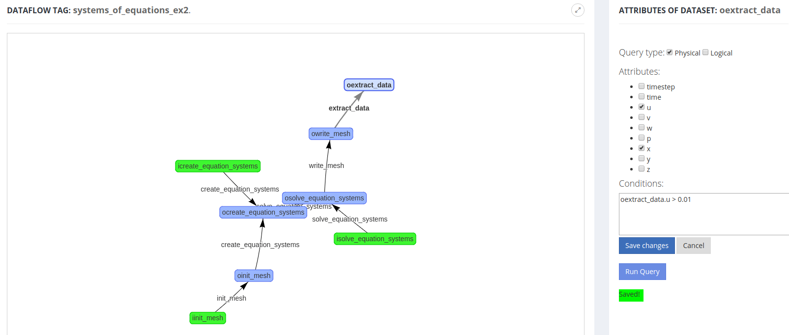

# DfAnalyzer tool

## Overview

This repository presents DfAnalyzer, a dataflow tool for monitoring, debugging, steering, and analyzing dataflow paths of scientific applications.

**Important note**: The components *Provenance Data Extractor* (PDE), *Dataflow Viewer* (DfViewer), *Query Interface* (QI), and *Query Dashboard* (QP) are implemented as Web applications and RESTful services in DfAnalyzer project.

## Software requirements

The following softwares have to be configured / installed for running this application.

### RESTful services, Raw Data Extractor (RDE), and Raw Data Indexer (RDI)

1. [Java](https://www.oracle.com/java/index.html) as the main programming language. (Please read the [tutorials](http://www.oracle.com/technetwork/java/javase/downloads/index.html) provided by Oracle Technology)
2. [Apache Maven](https://maven.apache.org/), the software project management and comprehension tool. 
3. [MonetDB](https://www.monetdb.org) as the open-source column-store database system. (Please follow their [user guide](https://www.monetdb.org/Documentation/UserGuide))
4. [FastBit](https://sdm.lbl.gov/fastbit/), an efficient compressed bitmap index technology.

### C++ library

1. [GCC](https://gcc.gnu.org/), the GNU Compiler Collection. (Please consider their [installation guide](https://gcc.gnu.org/install/))
2. [curl](https://curl.haxx.se/), a command line tool and library for transferring data with URLs. (Please read their [installation instructions](https://curl.haxx.se/download.html))
3. [boost](https://www.boost.org/), a package of free peer-reviewed portable C++ source libraries.

### Python library

1. [Python](https://www.python.org/), Python language interpreter version >= 3.5.2

## Installation

### RESTful services

DfAnalyzer project can be easily built by running the following command lines:

```bash
cd DfAnalyzer
mvn clean package
```

Then, the package file JAR is generated for DfAnalyzer project. It allows Java runtimes to efficiently deploy our tool. This JAR file is named as *DfAnalyzer-v2.jar* and it can be found in *./DfAnalyzer/target*.

### Raw Data Extractor and Indexer: RDE and RDI

RDE and RDI can also be compiled in the same way of RESTful services, as follows:

```bash
# Install maven libraries
cd maven
./install_libraries.sh

# RDE
cd ../RawDataExtractor
mvn clean package

# RDI
cd ../RawDataIndexer
mvn clean package
```

### C++ library: *dfa-lib-cpp*

The DfAnalyzer library for the programming language C++ can be built with the following command lines:

```bash
cd library/dfa-lib-cpp
make
```

Then, a static compiled library file, named as *libdfanalyzer.so*, is generated at the directory *library/dfa-lib-cpp/lib*.

### Python library: *dfa-lib-python*

The DfAnalyzer library for the programming language Python can be built with the following command lines:

```bash
cd library/dfa-lib-python
make install
```

## An overview of DfAnalyzer components and their documentations

### RESTful services

#### Initialization

The project DfAnalyzer at `dfanalyzer` contains all web applications and RESTful services provided by our tool. Therefore, the following components are present in this project: *Provenance Data Extractor* (PDE), *Dataflow Viewer* (DfViewer), *Query Interface* (QI), and *Query Dashboard* (QP).

We provide a compressed file of our MonetDB database (to DfAnalyzer) for a local execution of the project DfAnalyzer. Therefore, users only need to run the script `start-dfanalyzer.sh` at the path `application/dfanalyzer`. We assume the execution of these steps in an Unix-based operating system, as follows:

```bash
cd application/dfanalyzer
./start-dfanalyzer.sh
```

Then, a similar output message should be displayed in the terminal tab:

```
--------------------------------------------
Restoring MonetDB database...
--------------------------------------------
Starting database system...
property            value
hostname         localhost
dbfarm           /dfanalyzer/applications/dfanalyzer/data
status           monetdbd[3068] 1.7 (Jul2017-SP1) is serving this dbfarm
mserver          /program/monetdb/bin/mserver5
logfile          /dfanalyzer/applications/dfanalyzer/data/merovingian.log
pidfile          /dfanalyzer/applications/dfanalyzer/data/merovingian.pid
sockdir          /tmp
listenaddr       localhost
port             50000
exittimeout      60
forward          proxy
discovery        true
discoveryttl     600
control          no
passphrase       <unknown>
mapisock         /tmp/.s.monetdb.50000
controlsock      /tmp/.s.merovingian.50000
starting database 'dataflow_analyzer'... done
      name         state   health                       remarks
dataflow_analyzer  R  0s  100% 11s  mapi:monetdb://localhost:50000/dataflow_analyzer
--------------------------------------------
Starting DfA RESTful API

  .   ____          _            __ _ _
 /\\ / ___'_ __ _ _(_)_ __  __ _ \ \ \ \
( ( )\___ | '_ | '_| | '_ \/ _` | \ \ \ \
 \\/  ___)| |_)| | | | | || (_| |  ) ) ) )
  '  |____| .__|_| |_|_| |_\__, | / / / /
 =========|_|==============|___/=/_/_/_/
 :: Spring Boot ::        (v1.5.8.RELEASE)

2017-11-09 09:12:44.451  INFO 3073 --- [           main] rest.server.WebApplication               : Starting WebApplication v1.0 on mercedes with PID 3073 (/dfanalyzer/applications/dfa/DfA-1.0 started by vitor in /dfanalyzer/applications/dfanalyzer)
...
2017-11-09 09:12:55.397  INFO 3073 --- [           main] o.s.j.e.a.AnnotationMBeanExporter        : Registering beans for JMX exposure on startup
2017-11-09 09:12:55.419  INFO 3073 --- [           main] o.s.c.support.DefaultLifecycleProcessor  : Starting beans in phase 0
2017-11-09 09:12:55.815  INFO 3073 --- [           main] s.b.c.e.t.TomcatEmbeddedServletContainer : Tomcat started on port(s): 22000 (http)
2017-11-09 09:12:55.833  INFO 3073 --- [           main] rest.server.WebApplication               : Started WebApplication in 12.433 seconds (JVM running for 13.257)
```

#### Provenance Data Extractor (PDE)

Provenance Data Extractor (PDE) is a DfAnalyzer component responsible for extracting provenance and scientific data from scientific applications. With this purpose, PDE delivers a RESTful API that users can send HTTP request with POST method in order to register data extracted from their applications. These extracted data follows a dataflow abstraction, considering file and data element flow monitoring. Then, PDE stores these extracted data into a provenance database to enable online query processing.

Since our RESTful application has been initialized, users can submit HTTP requests with POST method to PDE for extracting provenance and scientific data. Then, considering the dataflow abstraction followed by DfAnalyzer, users have to introduce a message according to this abstraction. Therefore, PDE provides a set of methods to be present in the HTTP message, as follows:


This web page (http://localhost:22000/dfview/help) can be accessed using a browser after the initialization of DfAnalyzer.

**Example**

**Dataflow specification**

As an example of dataflow specification to be included in our provenance database, users submit the following HTTP request to PDE, considering a dataflow with one data transformation of our libMesh application (systems_of_equations_ex2):

HTTP message send to the URL `http://localhost:22000/pde/dataflow`

```bash
dataflow(systems_of_equations_ex2)

program(systems_of_equations_ex2::solver.solve(), /root/systems_of_equations_ex2)

dataset(ocreate_equation_systems, {n_dofs}, {NUMERIC})
dataset(isolve_equation_systems, 
            {dt, timesteps, nonlinear_steps, nonlinear_tolerance, nu},
            {NUMERIC, NUMERIC, NUMERIC, NUMERIC, NUMERIC})
dataset(osolve_equation_systems, 
            {timestep, time, nonlinear_steps, linear_iterations, final_linear_residual, norm_delta, converged},
            {NUMERIC, NUMERIC, NUMERIC, NUMERIC, NUMERIC, NUMERIC, TEXT})

transformation(solve_equation_systems, {ocreate_equation_systems, isolve_equation_systems}, {odeduplication}, )
```

**Task record**

After the dataflow specification, provenance and scientific data generated during the execution of scientific applications can be registered in our provenance database. In this case, PDE has to capture HTTP request in the task level (*i.e.*, execution of a data transformation).

For example, the following message should be sent in an HTTP request to the URL `http://localhost:22000/pde/task`

```bash
task(systems_of_equations,  solve_equation_systems, 1, RUNNING)

collection(ocreate_equation_systems, {{ dofs }})
collection(isolve_equation_systems, {{ timestep, time, nonlinear_steps, 
            linear_iterations, final_linear_residual, norm_delta, converged }})

dependency({create_equation_systems}, {1})
```

More details about DfAnalyzer RESTful services can be found [here](https://hpcdb.github.io/armful/dfanalyzer.html).

#### Dataflow Viewer (DfViewer)

After the provenance and domain data capture, users can also analyze dataflow specifications stored in our provenance database using DfViewer. DfViewer is a feature provided by our Web application.

As a first step, users have to use a Web browser (*e.g.*, Google Chrome) with the following URL for accessing DfViewer features:

```bash
http://localhost:22000 # users can also use the hostname for external connections
```

Then, they have access to a list of dataflow specifications stored in DfAnalyzer's database.


Since users have decided to view a specific dataflow by clicking on the button with the name *View* (*e.g.*, to analyze dataflow specification with tag *systems_of_equations_ex2*), then the following web page will be provided to them. This visualization consists of a dataset perspective view of the dataflow specification, where users can investigate the schema (*i.e.*, attributes of each dataset).


#### Query Interface (QI)

Query Interface (QI) is a DfAnalyzer component responsible to get user input, which characterizes and specifies the parameters and properties of the desired data, and then crafts a query responsible to retrieve the necessary datasets, data transformations and data attributes from the database.

Thus, QI generates a SQL-based query according to a specification, where:

* The SELECT clause is populated according to the user-specified projections, representing the data attributes chosen by the user;
* The WHERE clause, which is the most important one from the viewpoint of
  provenance tracing, acts like a filter by selecting and limiting the query to retrieve only the data elements (from datasets) that met a set of specified criteria (conditions);
* and, finally, the FROM clause contains the datasets from where the data attributes specified in the SELECT clause and the conditions specified in the WHERE clause are part of.

Query Interface key function is called <tt>generateSqlQuery</tt>, which
requires the following input arguments that need to be informed by
the users:

* D: the dataflow to be analyzed (it includes dataflow tag and identifier)
* dsOrigins: the datasets to be used as sources for the path finding algorithm;
* dsDestinations: the datasets to be used as destinations (ends) for the path finding algorithm;
* type: the attribute mapping type, which can be either logical (based on domain-specific attributes), physical (based on the identifiers of data transformations) or hybrid;
* projections: data attributes chosen to be part of the SELECT clause;
* selections: set of conditions intended to potentially filter and limit the query results, being part of the WHERE clause;
* dsIncludes: datasets that must be present in the paths found by the path
  finding algorithm;
* dsExcludes: datasets that must not be present in the paths found by the path finding algorithm.

By calling <tt>generateSqlQuery</tt> with the desired arguments, the user is capable of generating and running a SQL code using QI.

Using the RESTful API of DfAnalyzer, users can submit HTTP requests with the POST method to run queries in DfAnalyzer's database. So, these requests have to use the URL `http://localhost:22000/query_interface/{dataflow_tag}/{dataflow_id}` and to add a message, which should contain the query specification as follows:

**Table**: query specification using QI.

Concept | Method (body of the HTTP request) | Additional information
--- | --- | ---
Mapping | mapping(type) | type = PHYSICAL, LOGICAL, HYBRID
Source datasets | source(datasetTags)
Target datasets | target(datasetTags)
Includes | include(datasetTags) | Datasets to be included in the fragment of dataflow path.
Excludes | exclude(datasetTags) | Datasets to be excluded from the fragment of dataflow path.
Projections | projection(attributes) | *attributes* argument defines which attributes will be obtained after query processing, e.g., attributes = {table1.att1;table2.att2}
Selections | selection(conditions) | *conditions* is used to filter only relevant data elements, *e.g.*, table1.att1 > 100

**Example**

Considering our libMesh application (more details below) instrumented to extract provenance and scientific data using DfAnalyzer, users might like to investigate the data element flow from the input dataset *osolve_equation_systems* to the output dataset *oextract_data*, when the velocity of the fluid at the axis x is greater than 0.01. More specifically, they want to know in which times and distances (*oextract_data.x*, which is equivalent to the point in coordinate x) this situation occurs. The figure below presents the dataflow fragment analyzed by this query.


Based on this dataflow analysis, an HTTP request has to be submitted to our RESTful API with the following URL and message (*i.e.*, HTTP body).

URL:
```
http://localhost:22000/query_interface/systems_of_equations_ex2/2
``` 

Message:

```
mapping(physical)
source(osolve_equation_systems)
target(oextract_data)
projection(osolve_equation_systems.time; oextract_data.x;oextract_data.u)
selection(oextract_data.u > 0.01)
```

As a result, our RESTful API returns a CSV-format file with the selected content after the query processing.

#### Query Dashboard (QD)

Besides the query processing capabilities provided by QI, users can develop their queries using our graphical interface, as follows:



### DfA-lib in C++ and Python

Since the most of our computational scientists use the programming languages C++ and Python , we develop two libraries to make easier the addition of DfAnalyzer calls in scientific applications, named as dfa-lib-cpp and dfa-lib-python. In this regard, we also deliver a [documentation of dfa-lib in C++ or **dfa-lib-cpp**](https://dfa-lib-cpp-docs.herokuapp.com/) and a [documentation of dfa-lib in Python or **dfa-lib-python**](https://dfa-lib-python-docs.herokuapp.com/).

### RDE and RDI

The user guide of RDE and RDI can be found in their respective directories, as follows:

`RawDataExtractor` ([easy access with this link](./RawDataExtractor))

`RawDataIndexer` ([easy access with this link](./RawDataIndexer))

## Use in scientific applications

### C++ library

When computational specialist needs to configure the *Makefile* of his scientific application, he has to add the following set of directives used by a make build automation tool to generate a target/goal.

```bash
DFANALYZER_DIR 	?= $(DFANALYZER_REPOSITORY)/library/dfa-lib-cpp
LDFLAGS  += -lcurl -L$(DFANALYZER_DIR)/lib -ldfanalyzer
```

Then, he can run the command make for generating an executable file of his application.

# Docker image

Besides the source code of DfAnalyzer tool and its libraries, we also provide a Docker image, named as **dataflow_analyzer**, with DfAnalyzer tool; its libraries in C++ and Python, known as *dfa-lib*; and two Computational Science and Engineering (CSE) applications, named as *systems_of_equations_ex2* and *prototype_multi-physics*. 

The CSE application *systems_of_equations_ex2* was downloaded from [an example in libMesh website](https://libmesh.github.io/examples/systems_of_equations_ex2.html) and developed using *dfa-lib* in C++, while the application *prototype_multi-physics* used *dfa-lib* in Python. 

DfAnalyzer, its libraries, and CSE applications are stored in directories `DfAnalyzer`, `library`, and `applications` at the path `/dfanalyzer`. 

<a href="https://hub.docker.com/r/vitorss/dataflow_analyzer" target="_blank">
    
</a>

# Computational Science and Engineering (CSE) applications

Here we present the software requirements and how to run CSE applications *systems_of_equations_ex2* and *prototype_multi-physics*.

## Software requirements

### Systems of Equations - Example 2

1. [HDF5](https://support.hdfgroup.org/HDF5/), a data model, library, and file format for storing and managing data.
2. [PETSc](https://www.mcs.anl.gov/petsc/), the Portable, Extensible Toolkit for Scientific Computation.
3. [libMesh](http://libmesh.github.io/) as a framework for the numerical simulation of partial differential equations using arbitrary unstructured discretizations on serial and parallel platforms.

<a href="https://support.hdfgroup.org/HDF5/" target="_blank">
    
</a>
<a href="https://www.mcs.anl.gov/petsc/" target="_blank">
    
</a>
<a href="http://libmesh.github.io/" target="_blank">
    
</a>

There are also some optional software requirements, if raw data extraction and indexing capabilities are enabled, as follows.

1. [ParaView](https://www.paraview.org/), an open-source, multi-platform data analysis and visualization application.
2. [FastBit](https://sdm.lbl.gov/fastbit/), an efficient compressed bitmap index technology.

### Prototype of Multiphysics Application

1. [FEniCS](https://fenicsproject.org/) as a framework for the numerical simulation of partial differential equations using arbitrary unstructured discretizations on serial and parallel platforms.
2. [DfA-lib-Python](https://dfa-lib-python-docs.herokuapp.com/) A DfAnalyzer library implemented in Python for extracting provenance data, extracting raw data from data sources, and generating indexes of extracted data at runtime based on the usage of DfAnalyzer RESTful services. 
3. [Conda](https://conda.io/docs/index.html), a package dependency and environment management for Python.

<a href="https://fenicsproject.org/" target="_blank">
    
</a>
<a href="https://conda.io/docs/index.html" target="_blank">
    
</a>

## How to run applications

### Systems of Equations - Example 2

#### Source code compilation

Application files are stored in directory `applications/systems_of_equations_ex2` and it has to be compiled. However, it is necessary to define the environment variable `LIBMESH_DIR` with the installation path of libMesh before to run the following command lines:

```bash
cd applications/systems_of_equations_ex2
make
```

#### Environment configuration for raw data extraction and visualization

If visualization and raw data extraction/indexing are enabled in the CSE application (according to the *#define* statements in `systems_of_equations_ex2.C`), it is necessary to configure some environment variables (`PARAVIEW`, `FASTBIT`), since this application will use ParaView tool for extracting raw data from files in [ExodusII](http://prod.sandia.gov/techlib/access-control.cgi/1992/922137.pdf) format and FastBit for applying bitmap indexing technique. Please find below the definition of these variables in our Docker image, besides the environment variable `LIBMESH_DIR`.

```bash
export LIBMESH_DIR=/program/libmesh
export PARAVIEW=/program/paraview
export FASTBIT=/program/fastbit
```

**Important note**: In our Docker image, it is not necessary to compile this application or configure the environment variables.

#### Run application

Then, the second example of Systems of Equations from libMesh website can be executed using DfAnalyzer. In this case, two terminal connections have to be initialized. In the first terminal connection, we will initialize DfAnalyzer RESTful services by running the script `start-dfanalyzer.sh` at `applications/dfanalyzer`. After that, we start the CSE application by running the script `run.sh` at `applications/systems_of_equations_ex2`.

Command lines to the first terminal connection (*DfAnalyzer*):

```bash
cd applications/dfanalyzer
./start-dfanalyzer.sh
```

Command lines to the second terminal connection (*CSE application*):

```bash
cd applications/systems_of_equations_ex2
./run.sh
```

### Prototype of Multiphysics Application

#### Source code

Application files are stored in directory `applications/prototype_multiphysics_application` divided in three folders each one specific for one execution type, are they: `baseline`and `dfa`. It's necessary to install conda and them execute the following commands.

```bash
cd applications/prototype_multiphysics_application
conda create -n prototype_multiphysics_application -c conda-forge fenics
source activate prototype_multiphysics_application
make init
```

**Important note**: In our Docker image, it is not necessary to install the dependencies above.

#### Run application

Then, the prototype multiphysics application application can be executed using DfAnalyzer.

##### DfAnalyzer

In this case, two terminal connections have to be initialized. In the first terminal connection, we will initialize DfAnalyzer RESTful services by running the script `start-dfanalyzer.sh` at `applications/dfanalyzer`. After that, we start the CSE application by executing the command line `make run-dfa` at `applications/prototype_multiphysics_application`.

Command lines to the first terminal connection (*DfAnalyzer*):

```bash
cd applications/dfanalyzer
./start-dfanalyzer.sh
```

Command lines to the second terminal connection (*CSE application*):

```bash
cd applications/prototype_multiphysics_application
source activate prototype_multiphysics_application
make run-dfa
```

## License Terms

The MIT License (MIT)

Copyright (c) 2019 Federal University of Rio de Janeiro (UFRJ).

Permission is hereby granted, free of charge, to any person obtaining a copy of
this software and associated documentation files (the "Software"), to deal in
the Software without restriction, including without limitation the rights to
use, copy, modify, merge, publish, distribute, sublicense, and/or sell copies of
the Software, and to permit persons to whom the Software is furnished to do so,
subject to the following conditions:

The above copyright notice and this permission notice shall be included in all
copies or substantial portions of the Software.

THE SOFTWARE IS PROVIDED "AS IS", WITHOUT WARRANTY OF ANY KIND, EXPRESS OR
IMPLIED, INCLUDING BUT NOT LIMITED TO THE WARRANTIES OF MERCHANTABILITY, FITNESS
FOR A PARTICULAR PURPOSE AND NONINFRINGEMENT. IN NO EVENT SHALL THE AUTHORS OR
COPYRIGHT HOLDERS BE LIABLE FOR ANY CLAIM, DAMAGES OR OTHER LIABILITY, WHETHER
IN AN ACTION OF CONTRACT, TORT OR OTHERWISE, ARISING FROM, OUT OF OR IN
CONNECTION WITH THE SOFTWARE OR THE USE OR OTHER DEALINGS IN THE SOFTWARE.